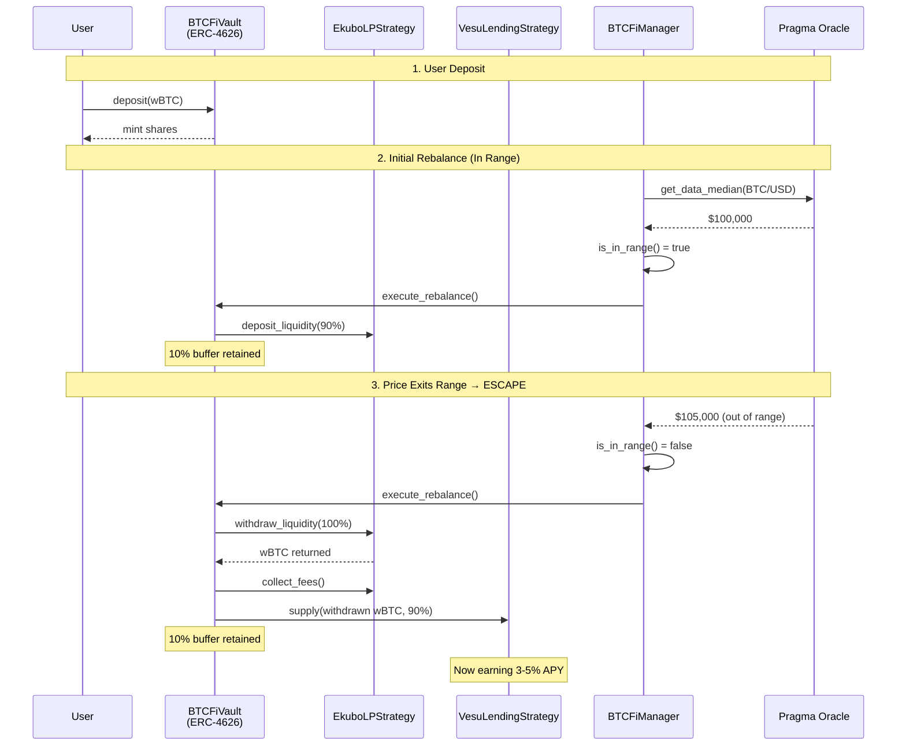
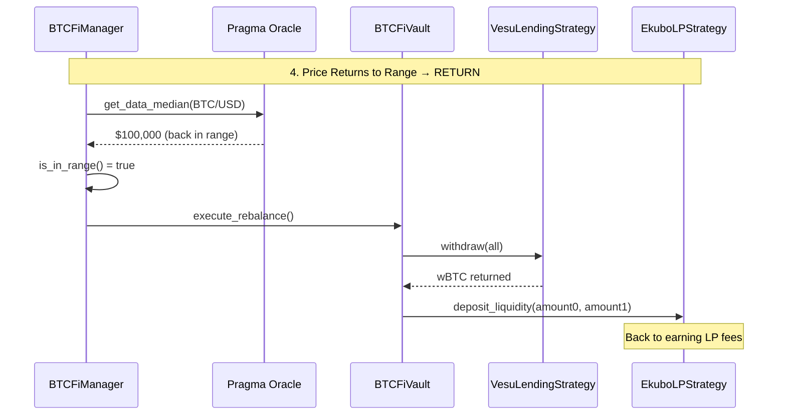
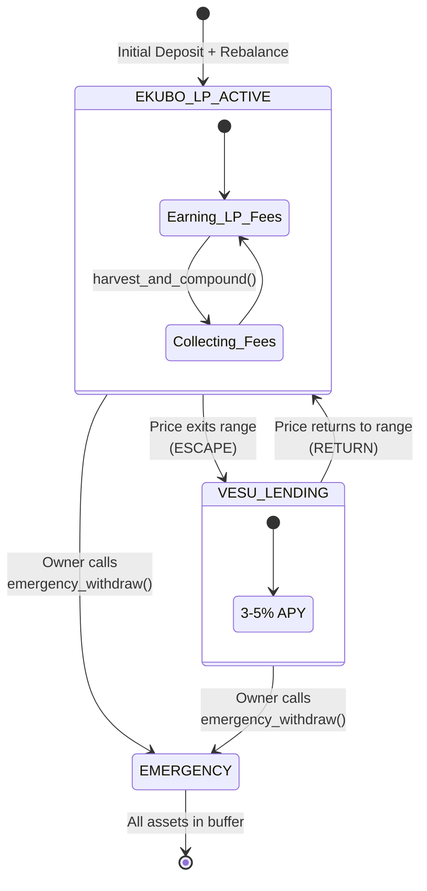
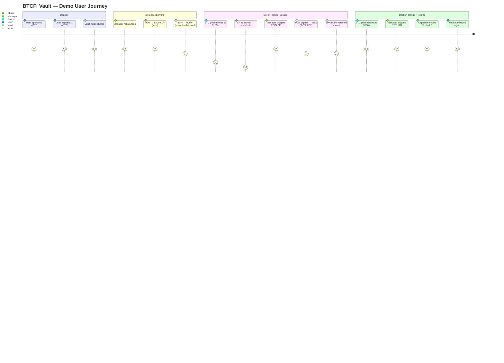
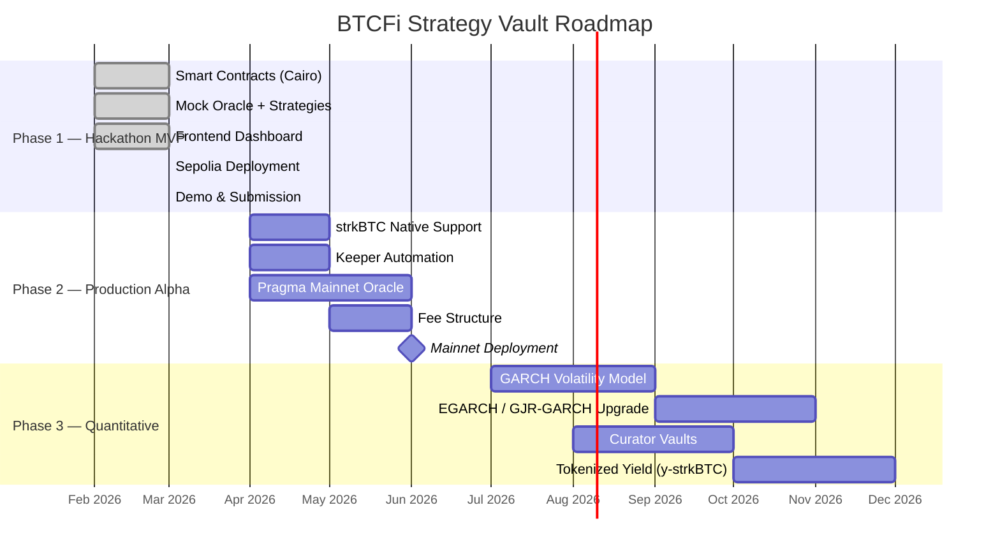

# BTCFi Strategy Vault

> **Your BTC capital never sleeps.**
> Auto-switches between Ekubo LP and Vesu Lending based on oracle price — zero idle capital.


---

## Table of Contents

- [Problem \& Solution](#problem--solution)
- [Architecture](#architecture)
  - [Escape Flow (Out of Range)](#escape-flow-out-of-range)
  - [Return Flow (Back in Range)](#return-flow-back-in-range)
  - [State Machine](#state-machine)
- [Tech Stack](#tech-stack)
- [Project Structure](#project-structure)
- [Getting Started](#getting-started)
- [Deployed Contracts (Sepolia)](#deployed-contracts-sepolia-testnet)
- [Demo Scenario](#demo-scenario)
- [Roadmap](#roadmap)
- [License](#license)

---

## Problem & Solution

**strkBTC** is bringing native BTC to Starknet — unlocking real BTC-denominated DeFi for the first time. But without smart yield infrastructure, BTC holders face a familiar problem: concentrated LP positions on Ekubo earn **0% yield** the moment price drifts out of range. Existing solutions (like Re7) re-range the LP — crystallizing impermanent loss. Capital sits idle, and holders lose out.

**BTCFi Strategy Vault** solves this. It detects out-of-range conditions via Pragma oracle and **escapes** to Vesu lending (3-5% APY). When price returns to range, it **returns** to Ekubo LP automatically. All on-chain, all verifiable.

> The current MVP uses wBTC on Sepolia testnet. **Phase 2 will integrate strkBTC natively** — making this vault a core yield layer for BTC on Starknet.

| Scenario | Re7 / Others | Manual LP | **Our Vault** |
|---|---|---|---|
| In Range | LP fee earning | LP fee earning | LP fee earning |
| Out of Range | Re-range (IL crystallized) | 0% yield (idle) | **Auto Vesu lending (90%)** |
| High Volatility | Repeated re-range = cumulative IL | 0% yield | **Stay in Vesu until stable** |
| Return to Range | Already re-ranged | Manual re-entry | **Auto LP re-entry** |

---

## Architecture

### Escape Flow (Out of Range)



### Return Flow (Back in Range)



### State Machine



---

## Tech Stack

| Layer | Stack |
|---|---|
| **Smart Contracts** | Cairo 2.14, Scarb 2.14, snforge 0.52, OpenZeppelin v3.0.0, Alexandria Math |
| **Frontend** | Next.js 14, TypeScript, TailwindCSS, Starknet.js v6, Privy Auth, Recharts |
| **Protocols** | Ekubo (concentrated LP), Vesu V2 (lending), Pragma (oracle) |
| **Testing** | snforge fork tests (Mainnet + Sepolia), Mock contracts |

---

## Project Structure

```
BTCLP/
├── src/
│   ├── vault/
│   │   └── btcfi_vault.cairo          # ERC-4626 vault (deposit/withdraw/share accounting)
│   ├── strategy/
│   │   ├── ekubo_lp.cairo             # Ekubo concentrated LP strategy
│   │   ├── vesu_lending.cairo         # Vesu V2 lending strategy
│   │   └── traits.cairo               # Strategy interface traits
│   ├── oracle/
│   │   └── btcfi_manager.cairo        # Rebalance logic + oracle integration
│   ├── interfaces/
│   │   ├── ekubo.cairo                # Ekubo ACL (vendored)
│   │   ├── vesu.cairo                 # Vesu V2 ACL (vendored)
│   │   ├── pragma.cairo               # Pragma ACL (vendored)
│   │   └── vault.cairo                # Vault interface
│   └── mocks/                         # Mock contracts for testing/demo
├── tests/
│   ├── test_vault.cairo               # Vault unit tests
│   ├── test_ekubo_strategy.cairo      # Ekubo strategy tests
│   ├── test_vesu_strategy.cairo       # Vesu strategy tests
│   ├── test_manager.cairo             # Manager logic tests
│   ├── test_integration.cairo         # Integration tests
│   └── test_fork.cairo                # Mainnet fork tests
├── frontend/                          # Next.js dashboard
├── scripts/
│   ├── deploy_sepolia.sh              # Sepolia deployment script
│   ├── mint_test_wbtc.sh              # Test token minting
│   └── deployed_addresses.txt         # Deployed contract addresses
├── Scarb.toml
└── snfoundry.toml
```

---

## Getting Started

### Prerequisites

- [Scarb](https://docs.swmansion.com/scarb/) >= 2.14.0
- [snforge](https://foundry-rs.github.io/starknet-foundry/) >= 0.52.0
- Node.js >= 18

### Smart Contracts

```bash
# Build
scarb build

# Run tests
scarb test
```

### Frontend

```bash
cd frontend
npm install
npm run dev
```

### Deployment (Sepolia)

```bash
./scripts/deploy_sepolia.sh
```

---

## Deployed Contracts (Sepolia Testnet)

Deployed: 2026-03-04 | Demo bounds: $99,500 - $103,000

| Contract | Address | Explorer |
|---|---|---|
| **BTCFiVault** | `0x2b74b61...2b882` | [Voyager](https://sepolia.voyager.online/contract/0x2b74b61014670ccde658d03505e15326a7d493bedec488b1e7f97d6aa12b882) |
| **BTCFiManager** | `0x460d2e1...2cbf` | [Voyager](https://sepolia.voyager.online/contract/0x460d2e1a5d6c0283de2e1fefddcf6ad9afb34f32ef050af68a294ef452a2cbf) |
| **EkuboLPStrategy** | `0x6c0ba50...2b6f` | [Voyager](https://sepolia.voyager.online/contract/0x6c0ba5081daf70b6fa0d58418d46403a8f1da4a28f215e5bd1b4864ae2c2b6f) |
| **VesuLendingStrategy** | `0x4e849f4...f279` | [Voyager](https://sepolia.voyager.online/contract/0x4e849f4f70c3bb2fb2c9c72511fd548f951a5f12b9345e089cd8a093de6f279) |
| **MockOracle** | `0x786ebf8...447d` | [Voyager](https://sepolia.voyager.online/contract/0x786ebf806c4cd158d58edc0486510daa9d43c573ea0ee8605720d21a2e447d) |
| **wBTC (Mock)** | `0x14cfad9...6291` | [Voyager](https://sepolia.voyager.online/contract/0x14cfad93c79be2f099b84748b7dbc9bbb7f81fccf4cba590711a6a8624c6291) |
| **USDC (Mock)** | `0x2977b4d...d76b` | [Voyager](https://sepolia.voyager.online/contract/0x2977b4d253eb53ddbff6df4d49519d7e8c0fc9d5093b652bad0fcff1fe2d76b) |

---

## Demo Scenario



### 1. Deposit

User approves and deposits **1 wBTC** into the Vault contract. The Vault mints proportional shares representing the user's ownership of the pool.

### 2. In-Range — Earning Yield

While BTC price stays within the configured band (`$99,500 – $103,000`), the Manager allocates capital across two DeFi protocols:

- **90%** → Ekubo concentrated LP — earns trading fees from the wBTC/USDC pair
- **10%** → Vault buffer — reserved for instant user withdrawals without unwinding positions

### 3. Out-of-Range — Escape Mode

When BTC price moves **outside** the LP range (e.g. spikes to $105k):

- Ekubo LP stops earning fees — capital sits idle with **0% yield**
- The Manager calls `escape()` to withdraw all capital from Ekubo
- **90% of capital** moves to Vesu lending, which continues earning **3–5% APY** regardless of price
- **10% buffer** remains in the vault for instant withdrawals
- User funds keep generating yield instead of sitting idle

### 4. Back-in-Range — Return Mode

When BTC price **returns** to the LP range:

- The Manager calls `return_to_lp()` to move capital back from Vesu to Ekubo
- Concentrated LP position is re-established, maximizing yield again
- The cycle repeats automatically as price fluctuates

> *"When LP yield drops to zero, we automatically move to lending. When LP becomes profitable again, we move back."*

---

## Roadmap



| Phase | Timeline | Scope |
|---|---|---|
| **Phase 1: Hackathon MVP** | March 2026 | 1 vault (wBTC/USDC), binary LP/Lending switch (90/10 buffer), MockOracle, Sepolia testnet |
| **Phase 2: Production** | Q2 2026 | strkBTC support, keeper automation, Pragma mainnet oracle, fee structure |
| **Phase 3: Quantitative** | Q3-Q4 2026 | GARCH/EGARCH volatility prediction, curator vaults, tokenized yield (y-strkBTC) |

---

## License

Apache License 2.0 — see [LICENSE](LICENSE) for details.
